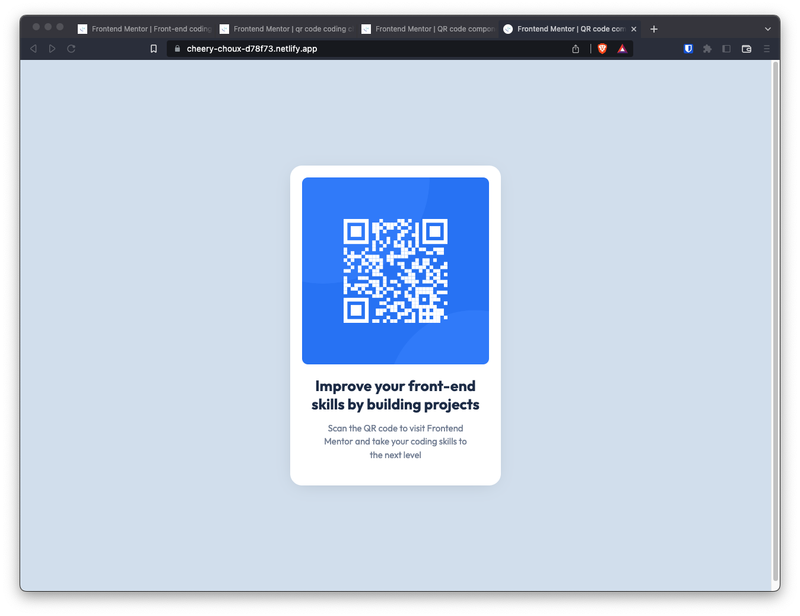

# Frontend Mentor - QR code component solution

This is a solution to the [QR code component challenge on Frontend Mentor](https://www.frontendmentor.io/challenges/qr-code-component-iux_sIO_H). Frontend Mentor challenges help you improve your coding skills by building realistic projects.

## Table of contents

- [Overview](#overview)
  - [Screenshot](#screenshot)
  - [Links](#links)
- [My process](#my-process)
  - [Built with](#built-with)
- [Author](#author)
- [Acknowledgments](#acknowledgments)

## Overview

### Screenshot

### Links

- Solution URL: [https://cheery-choux-d78f73.netlify.app/](https://cheery-choux-d78f73.netlify.app/)

## My process

### Built with

- (Semantic) HTML5 markup
- CSS custom properties
- Flexbox

## Author

- Website - [Act and Repeat](https://www.youtube.com/@actandrepeat)
- Frontend Mentor - [@actandrepeat](https://www.frontendmentor.io/profile/actandrepeat)

## Acknowledgments

- Thank you Wes Bos for a concise CSS Flexbox refresher at [WHAT THE FLEXBOX?](https://flexbox.io/)
